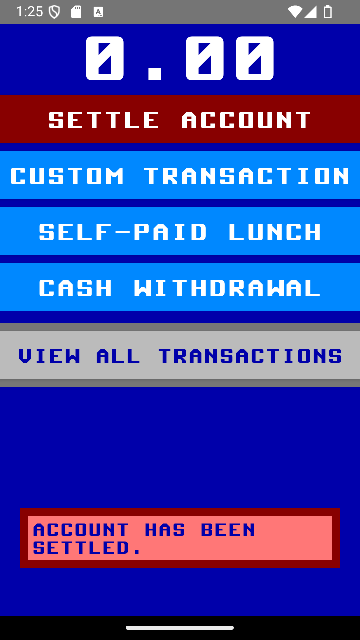
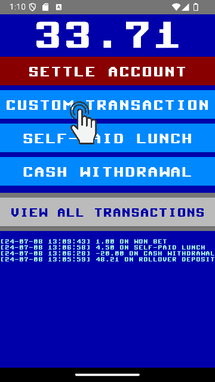

Keeping a **virtual account** is great way to forego cumbersome cash transfers or handing over physical money. Instead, you **keep track** how much money you have advanced for someone else until, finally, you **settle** the **account** after *many* transactions.

This app provides for such *virtual account*. It also adds some further funtions for convenience.

*Note that the only purpose of this app is to keep track of transactions without having to settle the account after each of them. No measures of establishing trust (e.g., proofs) are included. Hence, only use the app when trust is pre-established.*

# Use Cases

## Settle Account

|  |  |  |
| :--: | :--: | :--: |
| Start the settlement | Confirm   *or click on no to cancel* | Balance reset to zero   all transactions removed |

## Book Transaction by Applying Template

|  |  |
| :--: | :--: |
| Book transaction according to template `SELF-PAID LUNCH` | Transaction booked   *updates: the balance and the list of transactions* |

## Book Custom Transaction

|  |  |  |  |
| :--: | :--: | :--: | :--: |
| Start custom transaction | Enter amount and, optionally, description | Trigger the booking | Transaction booked |

## Book Custom Transaction and Retain as Template

|  |  |  |  |
| :--: | :--: | :--: | :--: |
| Start custom transaction | Check the `Save as template` box   after having entered amount and description | Trigger the booking | Transaction booked and template created |

## Undo Transaction

|  |  |  |  |
| :--: | :--: | :--: | :--: |
| Navigate to the transaction overview | Select the transaction | Swipe it to the left | Transaction undone   *also updates the balance* |

## Discard Template

|  |  |  |
| :--: | :--: | :--: |
| Long-press on template | Confirm the deletion   *or click outside to cancel* | Template (and its button) removed |

# Trivia

* *Visual design:* Heavily leans on the [Commodore 64](https://en.wikipedia.org/wiki/Commodore_64) with its fixed palette and fixed-width font. Still, some liberties have been taken:
	* The font is rounded, instead of being based on a `8x8` pixel array.
	* Small characters are averted as, back in the days, that meant that "drawing" characters were not available any more. However, they are still used occasionally (e.g., hints).
	* Visual elements are not placed within the block matrix, like the `40x25` matrix of the [Standard Character Mode](https://www.c64-wiki.com/wiki/Standard_Character_Mode).
	* Dark green has been added as one further color (the 17th) for consistent coloring within the `VIEW ALL ACTIVITIES` screen.
* *No permissions needed:* As seldom as this might be in 2024, the app only needs the `SharedPreferences` (and nothing else).
	* 

